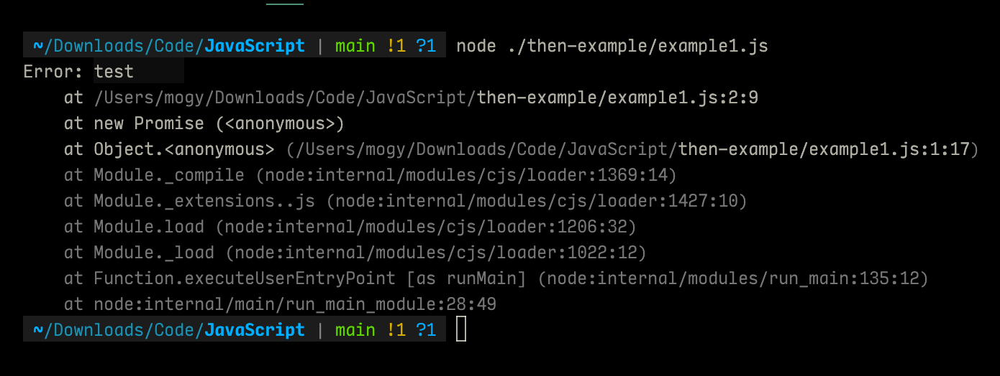

# 1.Promise 的含义

Promise 是异步编程的一种解决方案，比传统的解决方案（回调函数和事件）更合理和强大。它是由社区最早提出和实现，ES6 将其写进了语言标准，统一了用法，原生提供了`Promise`对象。

所谓`Promise`，简单说就是一个容器，里面保存着某个未来才会结束的事件（通常是一个异步操作）的结果。从语法上说，Promise 是一个对象，从它可以获取异步操作的消息。Promise 提供统一的 API，各种异步操作都可以用同样的方法进行处理。

Promise 对象具有以下两个特点：

1. 状态不受外部的影响
2. 一旦状态改变，就不会再变，任何时候都可以得到这个结果

Promise 的缺点：

1. 无法取消 Promise，一旦它创建就会立即执行，无法中途取消
2. 如果不设置回调函数，Promise 内部抛出错误，不会反应到外部
3. 当处于`pending`状态时，无法得知目前进展到哪一个阶段（刚刚开始还是直接完成）

# 2. 基本用法

ES6 规定，Promise 对象是一个构造函数，用来生成 Promise 实例

下面代码创建了一个 Promise 实例：

```javascript
const promise = new Promise(function (resolve, reject) {
  // do something...

  if(/*异步操作成功*/){
    resolve(value)
  }else{
    reject(reject)
  }
});
```

`Promise` 构造函数接受一个函数作为参数，该函数的操作分别为 `resolve` 和 `reject`。它们是两个函数。

`resolve` 函数的作用是，将 `Promise` 对象的状态从“未完成”变为”成功“（即从 `pending` 变成 `resolved`），
在异步操作成功时调用，并将异步操作的结果，作为参数传递出去；

`reject`函数的作用是，将`Promise`对象的状态从“未完成”变为“失败”（即从`pending`变成`rejected`），
在异步操作失败时调用，并将异步操作报出的错误，作为参数传递出去；

`Promise`实例生成以后，可以用`then`方法分别指定`resolved`状态和`reject`状态的回调函数。

```javascript
promise.then(
  function (value) {
    // success
  },
  function () {
    // failure
  }
);
```

`then`方法可以接受两个回调函数作为参数。第一个回调函数是`Promise`对象的状态变为`resolved`时调用，
第二个回调函数是`Promise`对象的状态变为`rejected`时调用。这两个参数都是可选的，不一定要提供。
它们都接受`Promise`对象传出去的值作为参数。下面是一个 Promise 对象的简单例子：

```javascript
function timeout(ms) {
  return new Promise(function (resolve, reject) {
    setTimeout(resolve, ms, "done");
  });
}

timeout.then((value) => {
  console.log(value);
});
```

上面代码中，`timeout`方法返回一个`Promise`实例，表示一段时间以后才会发生的结果。过了指定的时间以后，`Promise`实例的状态变为`resolved`，就会触发`then`方法绑定的回调函数。

Promise 新建后会立即执行。

```javascript
let promise = new Promise(function () {
  console.log("Promise");
  resolve();
});

promise.then(function () {
  console.log("resolved.");
});

console.log("Hi!");

// Promise
// Hi!
// resolved.
```

上面代码中，Promise 新建后立即执行，所以首先输出的是`Promise`。然后，`then`方法指定的回调函数，将在当前脚本所有同步任务执行完才会执行，所有`resolved`最后输出。

下面是异步加载图片的例子。

```javascript
function loadImageAsync() {
  return new Promise(function (resolve, reject) {
    const image = new Image();

    image.onload = function () {
      resolve();
    };

    image.onerror = function () {
      reject(new Error("Could not load image at" + url));
    };

    image.src = url;
  });
}
```

上面代码中，使用`Promise`包装了一个图片加载的异步操作。如果加载成功，就调用`resolve`方法，否则就调用`reject`方法。

下面是一个用`Promise`对象实现的 Ajax 操作的例子。

```javascript
const getJSON = function (url) {
  const promise = new Promise(function (resolve, reject) {
    const handler = function () {
      if (this.readyState !== 4) {
        return;
      }
      if (this.status === 200) {
        resolve(this.response);
      } else {
        reject(new Error(this.statusText));
      }
    };
    const client = new XMLHttpRequest();
    client.open("GET", url);
    client.onreadystatechange = handler;
    client.responseType = "json";
    client.setRequestHeader("Accept", "application/json");
    client.send();
  });

  return promise;
};

getJSON("/posts.json").then(
  function () {
    console.log("Contents：" + json);
  },
  function (error) {
    console.error("出错了", error);
  }
);
```

上面代码中，`getJSON`是对 XMLHttpRequest 对象的封装，用于发出一个针对 JSON 数据的 HTTP 请求，并且返回一个`Promise`对象。需要注意的是，在`getJSON`内部，`resolve`函数和`reject`函数调用时，都带有参数。

如果调用`resolve`函数和`reject`函数时带有参数，那么它们的参数会被传递给回调函数。`reject`函数的参数通常是`Error`对象实例，表示抛出的错误；`resolve`函数的参数除了正常的值以外，还可能是另一个 Promise 实例，比如像下面这样。

```javascript
const p1 = new Promise(function (resolve, reject) {
  // ...
});

const p2 = new Promise(function (resolve, reject) {
  resolve(p1);
});
```

上面代码中，`p1`和`p2`都是 Promise 的实例，但是`p2`的`resolve`方法将`p1`作为参数，即一个异步操作的结果是返回另一个异步操作。
注意，这时`p1`的状态就会传递给`p2`，也就是说，`p1`的状态决定了`p2`的状态。如果`p1`的状态是 `pending`，那么 `p2` 的回调函数就会等待 `p1` 的状态改变；如果 `p1` 的状态已经是 `resolved` 或这 `rejected`，那么 p2 的回调函数将会立即执行。

```javascript
const p1 = new Promise(function (resolve, reject) {
  setTimeout(() => reject(new Error("fail")), 3000);
});

const p2 = new Promise(function (resolve, reject) {
  setTimeout(() => resolve(p1), 1000);
});

p2.then((result) => console.log(result)).catch((error) => console.log(error));

// Error:fail
```

上面代码中，`p1`是一个 Promise，3 秒之后变为`rejected`。`p2`的状态在 1 秒之后改变，`resolve`方法返回的是`p1`。由于`p2`返回的是另一个 Promise，导致`p2`自己的状态无效了，由`p1`的状态决定`p2`的状态。所以，后面的`then`语句都变成针对后者（`p1`）。又过了 2 秒，`p1` 变为`rejected`，导致触发 `catch` 方法指定的回调函数。

注意，调用 `resolve` 或者 `reject` 函数并不会终结 Promise 的参数函数的执行。

```javascript
new Promise((resolve, reject) => {
  resolve(1);
  console.log(2);
}).then((res) => {
  console.log(r);
});

// 2
// 1
```

上面代码中，调用`resolve(1)`以后，后面的`console.log(2)`还是会执行，并且会首先打印出来。这是因为立即 resolved 的 Promise 是在本轮事件循环的末尾执行，总是晚于本轮循环的同步任务。

一般来说，调用`resolve`和`reject`以后，Promise 的使命就完成了，后续操作应该放到`then`方法里面，而不应该直接写在 resolve 或 reject 的后面。所以，最好在它们前面加上`return`语句，这样就不会有意外。

```javascript
new Promise((resolve, reject) => {
  return resolve(1);
  //  后面不会执行
  console.log(2);
}).then((res) => {
  console.log(res);
});

// 1
```

# 3. Promise.prototype.then()

Promise 实例具有`then`方法，也就是说，`then`方法是定义在原型对象`Promise.prototype`上的。它的作用是为 `Promise` 实例添加状态改变时的回调函数。`then`方法的第一个参数是`resolved`状态的回调函数，第二个参数是`rejected`状态的回调函数，它们都是可选的。
`then`方法返回的是一个新的`Promise`实例（注意，不是原来那个`Promise`实例）。因此可以采用链式写法，即`then`方法后面再调用一个`then`方法。

```javascript
getJSON8("/posts.json")
  .then(function (json) {
    return json.post;
  })
  .then(function (post) {
    // ...
  });
```

上面的代码使用`then`方法，依次指定了两个回调函数。第一个回调函数完成以后，会将返回结果作为参数，传入第二个回调函数。
采用链式的`then`，可以指定一组按照次序调用的回调函数。这时，前一个回调函数，有可能返回的还是一个`Promise`对象（即有异步操作），这时后一个回调函数，就会等待该`Promise`对象的状态发生变化，才会被调用。

```javascript
getJSON("/post/1.json")
  .then(function (post) {
    return getJSON(post.commentURL);
  })
  .then(
    function (comments) {
      console.log("resolved: ", comments);
    },
    function (err) {
      console.log("rejected: ", err);
    }
  );
```

上面的代码中，第一个`then`方法指定的回调函数，返回的是另一个`Promise`对象。这时，第二个`then`方法指定的回调函数，就会等待这个新的`Promise`对象状态发生变化。如果变为`resolved`,就调用第一个回调函数，如果状态为`rejected`，就调用第二个回调函数。
如果采用箭头函数，上面的代码可以写得更简洁。

```javascript
getJSON("/post/1.json")
  .then((post) => getJSON(post.comments))
  .then(
    (comments) => console.log("resolved: ", comments),
    (err) => console.log("rejected: ", err)
  );
```

# 4. Promise.prototype.catch()

`Promise.prototype.catch()`方法是`.then(null,rejection)`或 `.then(undefined,rejection)`的别名，用于指定发生错误时的回调函数。

```javascript
getJSON("/posts.json")
  .then(function (posts) {
    // ...
  })
  .catch(function (error) {
    // 处理getJSON 和前一个回调函数运行时发生的错误
    console.log("发生错误！", error);
  });
```

上面的代码中，`getJSON()`方法返回一个 Promise 对象，如果该对象状态变为`resolved`，则会调用`then()`方法指定的回调函数；如果异步操作抛出错误，状态就会变为`rejected`,就是调用`catch()`方法指定的回调函数，处理这个错误。另外，`then()`方法指定的回调函数，如果运行中抛出错误，也会被`catch()`方法捕获。
下面是一个例子:

```javascript
const promise = new Promise(function (resolve, reject) {
  throw new Error("test");
});

promise.catch(function (error) {
  console.log(error);
});
```

输出的结果为
上面代码中，`promise`抛出一个错误，就被`catch()`方法指定的回调函数捕获。注意，上面的写法与下面两种写法是等价的。

```javascript
// 写法一
const promise = new Promise(function(resolve,reject){
  try{
    throw new Error('test')
  }.catch(e){
    reject(e)
  }
})
promise.catch(function(error){
  console.log(error)
})

// 写法二
const promise = new Promise(function(resole,reject){
  reject(new Error('test'))
})
promise.catch(function(error){
  console.log(error)
})
```

比较上面两种写法，可以发现`reject()`方法的作用，等同于抛出错误。

如果 Promise 状态已经变成`resolved`，再抛出错误是无效的。

```javascript
const promise = new Promise(function (resolve, reject) {
  resolve("ok");
  throw new Error("test");
});

promise
  .then(function (value) {
    console.log(value);
  })
  .catch(function (error) {
    console.log(error);
  });
```

上面的代码中，Promise 在`resolve`语句后面，再抛出异常，不会被捕获，等于没有抛出。因为 Promise 的状态一旦改变，就永久保持该状态，不会再改变了。

Promise 对象的错误具有“冒泡”性质，会一直向后传递，直到被捕获为止。也就是说，错误总是会被下一个`catch`语句捕获。

```javascript
getJSON("/post/1.json")
  .then(function (post) {
    return getJSON(post.commentURL);
  })
  .then(function (comments) {
    // some code
  })
  .catch(function (error) {
    // 处理前面三个Promise产生的错误
  });
```

上面的代码中，一共有三个 Promise 对象：一个由`getJSON()`产生，两个由`then()`产生。它们之中任何一个抛出的错误，都会被最后一个`catch()`捕获。
一般来说，不要在`then()`方法里面定义 Reject 状态的回调函数（即`then`的第二个参数），总是使用`catch`方法。

```javascript
// bad
promise.then(
  function (data) {
    // success
  },
  function (err) {
    // error
  }
);

// good
promise
  .then(function (data) {
    // success
  })
  .catch(function (err) {
    // error
  });
```

上面代码中，第二种写法要好于第一种写法，理由是第二种写法可以捕获前面`then`方法执行中的错误，也更接近于同步的写法（`try/catch`）。因此，建议总是使用`catch()`方法，而不使用`then()`方法的第二个参数。

跟传统的`try/catch`代码块不同的是，如果没有使用`catch()`方法指定错误处理的回调函数，Promise 对象抛出的错误不会传递到外层代码，即不会有任何反应。

```javascript
const someAsyncThing = function () {
  return new Promise(function (resolve, reject) {
    // 下面一行会报错，因为x没有声明
    resolve(x + 2);
  });
};

someAsyncThing().then(function () {
  console.log("everything is great");
});

setTimeout(() => {
  console.log(123);
}, 2000);

// node环境输出：
// Uncaught (in promise) ReferenceError: x is not defined

// 浏览器：
// Uncaught (in promise) ReferenceError: x is not defined
// 123
```

上面代码中，`someAsyncThing()`函数产生的 Promise 对象，内部有语法错误。浏览器运行到这一行，会打印出错误提示`ReferenceError: x is not defined`，但是不会退出进程、终止脚本执行，2 秒之后还是会输出`123`。这就是说，Promise 内部的错误不会影响到 Promise 外部的代码，通俗的说法就是“Promise 会吃掉错误”。
这个脚本放在服务器执行，退出码就是`0`(表示执行成功)。不过，Node.js 有一个 `unhandleRejection` 事件，专门监听未捕获的`reject`错误，上面的脚本会触发这个事件的监听函数，可以在监听函数里面抛出错误。

```javascript
process.on("unhandleRejection", function (err, p) {
  throw err;
});
```

上面代码中，`unhandleRejection`事件的监听函数有两个参数，第一个是错误对象，第二个是报错的 Promise 实例，它可以用来了解发生错误的环境信息。
注意，Node 有计划在未来废除`unhandleRejection`事件。如果 Promise 内部有未捕获的错误，会直接终止进程，并且进程的退出代码不为 `0`。

在看下面的例子：

```javascript
const Promise = new Promise(function (resolve, reject) {
  resolve("OK");
  setTimeout(function () {
    throw new Error("test");
  }, 0);
});

promise.then(function (value) {
  console.log(value);
});
```

上面代码中，Promise 指定在下一轮“事件循环”再抛出错误。到了那个时候，Promise 的运行已经结束了，所以这个错误是在 Promise 函数体外抛出的，回冒泡到最外层，成了未捕获的错误。

一般总是建议，Promise 对象后面要跟`catch()`方法，这样可以处理 Promise 内部发生的错误。`catch()`方法返回的是一个 Promise 对象，因此后面还可以接着调用`then()`方法。

```javascript
const someAsyncThing = function () {
  return new Promise(function (resolve, reject) {
    // 下面一行会报错，因为x没有声明
    resolve(x + 2);
  });
};

someAsyncThing()
  .catch(function (error) {
    console.log("oh no", error);
  })
  .then(function () {
    console.log("carry on");
  });
// oh no [ReferenceError: x is not defined]
// carry on
```

上面代码运行完`catch()`方法指定的回调函数，会接着运行后面那个`then()`方法指定的回调函数。如果没有报错，则会跳过`catch()`方法。
`catch()`方法之中，还能再抛出错误。

```javascript
const someAsyncThing = function () {
  return new Promise(function (resolve, reject) {
    // 下面一行会报错，因为x没有声明
    resolve(x + 2);
  });
};

someAsyncThing()
  .then(function () {
    return someOtherAsyncThing();
  })
  .catch(function (error) {
    console.log("oh no", error);
    // 下面一行会报错，因为y没有声明
    y + 2;
  })
  .then(function () {
    console.log("carry on");
  });
// oh no [ReferenceError: x is not defined]
```

上面代码中，`catch()`方法抛出一个错误，因为后面没有别的`catch()`方法了，导致这个错误不会被捕获，也不会传递到外层。如果改写一下，结果就不一样了。

```javascript
onst someAsyncThing = function () {
  return new Promise(function (resolve, reject) {
    // 下面一行会报错，因为x没有声明
    resolve(x + 2);
  });
};

someAsyncThing()
  .then(function () {
    return someOtherAsyncThing();
  })
  .catch(function (error) {
    console.log("oh no", error);
    // 下面一行会报错，因为y没有声明
    y + 2;
  })
  .catch(function () {
    console.log("carry on");
  });
  // oh no [ReferenceError: x is not defined]
  // carry on [ReferenceError: y is not defined]
```

上面代码中，第二个`catch()`方法用来捕获前一个`catch()`方法抛出的错误。

# 5. Promise.prototype.finally()

`finally`方法用于指定不管 Promise 对象最后状态如何，都会执行的操作。该方法是 ES2008 引入标准的。

```javascript
promise.then(result =>{...}).catch(error =>{...}).finally(()=>{...})
```

上面的代码不管`promise`最后的状态，在执行完`then`或`catch`指定的回调函数以后，都会执行`finally`方法指定的回调函数。
下面是一个例子，服务器使用 promise 处理请求，然后使用`finally`方法关闭服务器。

```javascript
server
  .listen(port)
  .then(function () {
    // ...
  })
  .finally(server.stop);
```

`finally`方法的回调不接受任何参数，这意味着没有办法知道，前面的 Promise 状态到底是`fullfilled`还是`rejected`。这表明，`finally`方法里面的操作，应该是与状态无关的，不依赖于 Promise 的执行结果。

`finally`本质上是`then`方法的一个特例。

```javascript
promise.finally(() => {
  // 语句
});

//等同于
promise.then(
  (result) => {
    // 语句
    return result;
  },
  (error) => {
    // 语句
    return error;
  }
);
```

上面的代码中，如果不使用`finally`方法，同样的语句需要为成功和失败两种情况各写一次。有了`finally`方法，则只需要写一次。

它的实现也很简单。

```javascript
Promise.prototype.finally = function (callback) {
  let P = this.constructor;
  return this.then(
    (value) => P.resolve(callback()).then(() => value),
    (reason) =>
      P.resolve(callback()).then(() => {
        throw reason;
      })
  );
};
```

上面代码中，不管前面的 Promise 是`fullfilled`还是`rejected`，都会执行回调函数`callback`。
从上面的实现还可以看到，`finally`方法总是会返回原来的值。

```javascript
// resolve 的值是undefined
Promise.resolve(2).then(
  () => {},
  () => {}
);

// resolve的值是2
Promise.resolve(2).finally(() => {});

// reject的值是undefined
Promise.reject(3).then(
  () => {},
  () => {}
);

// reject的值是3
Promise.reject(3).finally(() => {});
```
